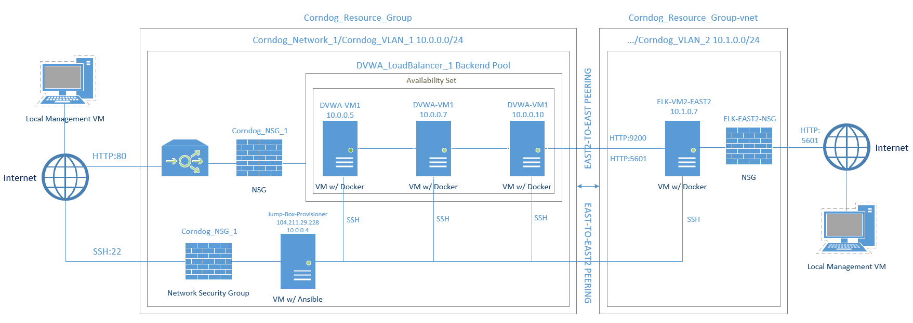
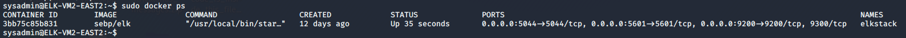

## Automated ELK Stack Deployment

The files in this repository were used to configure the network depicted below.

These files have been tested and used to generate a live ELK deployment on Azure. They can be used to either recreate the entire deployment pictured above. Alternatively, select files such as filebeat-playbook.yml may be used to install only certain pieces of it, such as Filebeat.
  - install-elk.yml
  - dvwa-playbook.yml
  - filebeat-playbook.yml
  - metricbeat-playbook.yml

This document contains the following details:
- Description of the Topology
- Access Policies
- ELK Configuration
  - Beats in Use
  - Machines Being Monitored
- How to Use the Ansible Build

### Description of the Topology

The main purpose of this network is to expose a load-balanced and monitored instance of DVWA, the D*mn Vulnerable Web Application.

Load balancing ensures that the application will be highly redundant, in addition to restricting external access to the network.
- What aspect of security do load balancers protect? Availability. 
- What is the advantage of a jump box? By using a jump box you limit the number of external network connections to the DVWA hosts. Limiting the number of external network connections effectively allow you to monitor all inbound and outbound traffic to the DVWA hosts from one access point.

Integrating an ELK server allows users to easily monitor the vulnerable VMs for changes to the host and system statistics.
- Filebeat watches for changes to syslogs, auth logs, and events generated by privileged commands like sudo, useradd, and groupadd.
- Metricbeat records CPU, memory, network, and disk statistics. 

The configuration details of each machine may be found below.
_Note: Use the [Markdown Table Generator](http://www.tablesgenerator.com/markdown_tables) to add/remove values from the table_.

| Name                 | Function              | Public IP Address                        | Private IP Address | Operating System         |
|----------------------|-----------------------|------------------------------------------|--------------------|--------------------------|
| Jump-Box-Provisioner | Gateway/Jumpbox       | 104.211.29.228                           | 10.0.0.4           | Linux (Ubuntu 18.04)     |
| DVMA-VM1             | App Webserver         | N/A (52.186.27.128 loadbalanced)         | 10.0.0.5           | Linux (Ubuntu 18.04)     |
| DVMA-VM2             | App Webserver         | N/A (52.186.27.128 loadbalanced)         | 10.0.0.7           | Linux (Ubuntu 18.04)     |
| DVMA-VM3             | App Webserver         | N/A (52.186.27.128 loadbalanced)         | 10.0.0.10          | Linux (Ubuntu 18.04)     |
| ELK-VM2-EAST2        | Security Monitoring   | 52.177.151.29                            | 10.1.0.7           | Linux (Ubuntu 18.04)     |
| DVWA_LoadBalancer_1  | Loadbalancer          | 52.186.27.128                            | N/A                | N/A (Azure Loadbalancer) |

### Access Policies

The machines on the internal network are not exposed to the public Internet. 

Only the DVWA machines can accept HTTP connections from the Internet. Access to all machines is only allowed from the following IP addresses:
- 76.122.111.240/32
- 136.55.161.237/32

Machines within the network can only be accessed via SSH by Jump-Box-Provisioner.
- Which machine did you allow to access your ELK VM? What was its IP address?
   - Jump-Box-Provisioner is the only machine with SSH access to the ELK VM. My local machine has HTTP GUI access via port 5601.

A summary of the access policies in place can be found in the table below.

| Name                 | Publicly Accessible             | Allowed IP Addresses                                                     |
|----------------------|---------------------------------|--------------------------------------------------------------------------|
| Jump-Box-Provisioner | Yes (SSH)                       | 76.122.111.240/32 (SSH), 136.55.161.237/32 (SSH from my GFs apartment)   |
| DVMA-VM1             | No* (HTTP through loadbalancer) | 10.0.0.4/32 (SSH)                                                        |
| DVMA-VM2             | No* (HTTP through loadbalancer) | 10.0.0.4/32 (SSH)                                                        |
| DVMA-VM3             | No* (HTTP through loadbalancer) | 10.0.0.4/32 (SSH)                                                        |
| ELK-VM2-EAST2        | Yes (Port 5601)                 | 10.0.0.4/32 (SSH)                                                        |
| DVWA_LoadBalancer_1  | Yes*                            | 76.122.111.240/32 (HTTP), 136.55.161.237/32 (HTTP from my GFs apartment) |

### Elk Configuration

Ansible was used to automate configuration of the ELK machine. No configuration was performed manually, which is advantageous because...
- The main advantage of automating configuration with Ansible is that I can easily add and remove machines to my environment as well as quickly make changes to all the machines in my environment at the same time. For example if it turns out that having three loadbalanced DVWA machines is not enough to handle all the traffic they receive then I can add a new machine to the backend pool and quickly configure it via Ansible.

The playbook implements the following tasks:
- install-elk.yml
   - Install Docker.io via apt
   - Install PIP via apt
   - Install Docker python module via pip
   - Increase virtual memory
   - Download and launch Docker ELK container
- dvwa-playbook.yml
   - Install Docker.io via apt
   - Install PIP via apt
   - Install Docker python module via pip
   - Download and launch Docker web app (DVWA) container
- filebeat-playbook.yml
   - Download Filebeat debian image
   - Install Filebeat
   - Drop in the filebeat-configuration to the hosts
   - Enable and configure the filebeat system module
   - Setup Filebeat
   - Start Filebeat
- metricbeat-playbook.yml
   - Download Metricbeat debian image
   - Install Metricbeat
   - Drop in the metricbeat-configuration to the hosts
   - Enable and configure the metricbeat system module
   - Setup Metricbeat
   - Start Metricbeat

The following screenshot displays the result of running `docker ps` after successfully configuring the ELK instance.

### Target Machines & Beats
This ELK server is configured to monitor the following machines:
- 10.0.0.5
- 10.0.0.7
- 10.0.0.10

We have installed the following Beats on these machines:
- Filebeats
- Metricbeats

These Beats allow us to collect the following information from each machine:
- Filebeat: The data that Elasticsearch/Logstash/Kibana receives from Filebeat are logs created by the system logging service of Linux distro that Filebeat is running on, which in this case is Ubuntu 18.04. Per review of the exported fields from the system log files that Filebeat collects, I noted that it collects authorization logs, events created by the sudo, useradd, and groupadd commands, and syslog system logs. 
- Metricbeat: ELK receives host CPU, memory, network, and disk statistics collected by Metricbeat. These statistics are collected system wide and per process and filesystem. Per review of the exported fields collected by Metricbeats, I noted that it collects local system metrics, CPU metrics for a single core of a multi-core system, local CPU stats, disk IO metrics from the OS, system entropy, local filesystem stats, filesystem metrics aggregated from all mounted filesystems, nested file system size, CPU load averages, memory stats, actual memory used and free, SWAP stats, memory page stats, stats related to huge pages usage, huge pages SWAP, network IO metrics, global network activity, process metadata, per process CPU and memory stats, and more.

### Using the Playbook
In order to use the playbook, you will need to have an Ansible control node already configured. Assuming you have such a control node provisioned: 

SSH into the control node and follow the steps below:
- Copy the playbooks to /etc/ansible/roles
- Copy the *beat configuration files to /etc/ansible/files
- Update the /etc/ansible/hosts file to include the private IP addresses of the target machines under "webservers" and create a heading for "elkservers" to add the private IP of the ELK server.
- Update the remote_user in /etc/ansible/ansible.cfg the admin account provisioned to the target machines
- Update the *beat configuration files on lines #1106 and #1806 to include the private IP of the ELK server
- Run the playbooks, and navigate to http://[your.ELK.IP]:5601 to check that the ELK installation worked as expected. Navigate to http://[your.DVWA.IP] to check that the DVWA installation(s) worked as expected.

_As a **Bonus**, provide the specific commands the user will need to run to download the playbook, update the files, etc._
